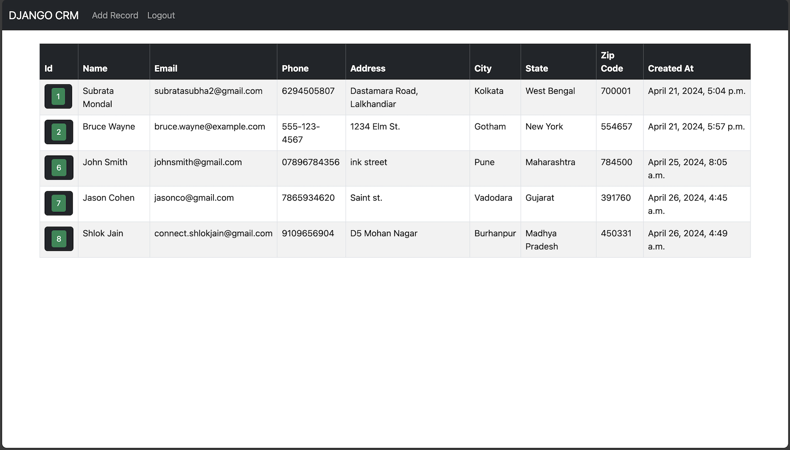
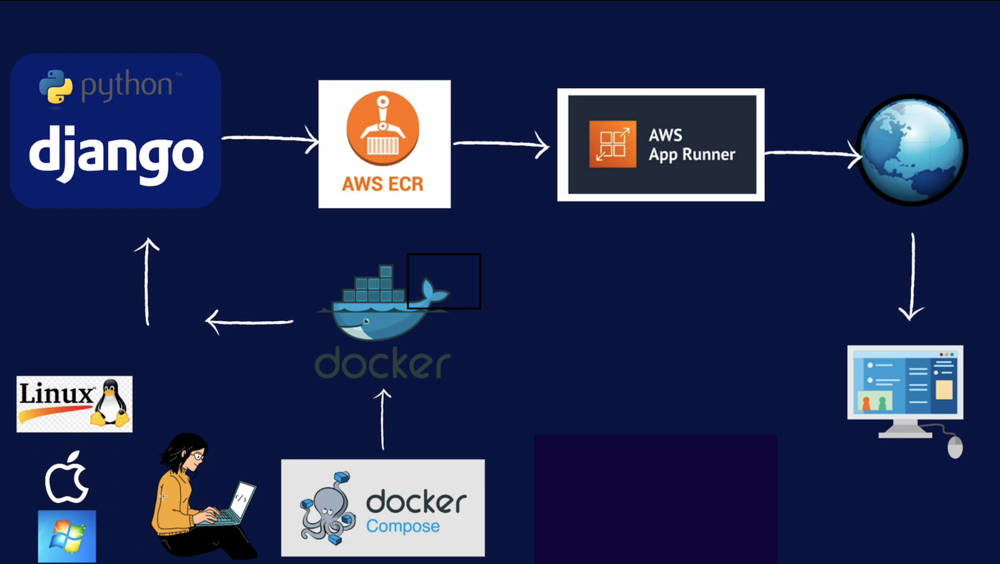
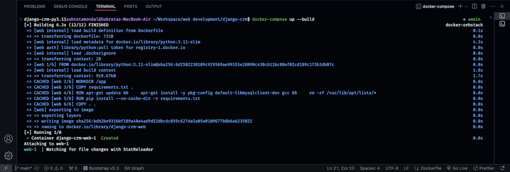
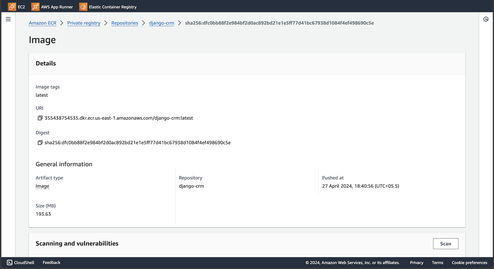
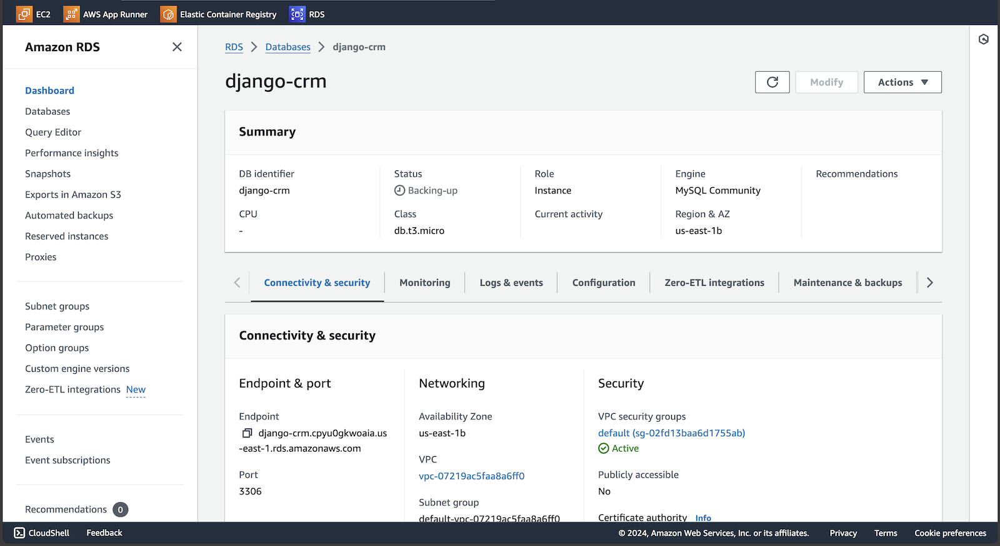
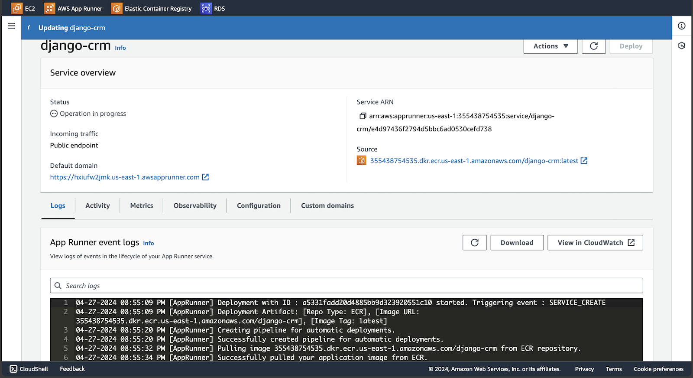

<h1 align="center">DJANGO CRM</h1>

<p align="center">
    <a href="https://github.com/subratamondal1/django-crm/actions/workflows/devops.yml">
        
    </a>
</p>



<h2 align="center">TECH STACK</h2>
<p align="center">
  
</p>

<p align="center">
<strong>PYTHON,</strong>
<strong>DJANGO,</strong>
<strong>MYSQL,</strong>
<strong>GITHUB ACTIONS (CI/CD),</strong>
<strong>HTML,</strong>
<strong>CSS,</strong>
<strong>DOCKER,</strong>
<strong>AWS,</strong>
<strong>GIT,</strong>
<strong>GITHUB.</strong>
</p>

<h2 align="center">STEPS</h2>

<h3 align="left">Make the Website Up & Running</h3>

1. ✅ Create Github Repository **django-crm**. Clone it in the local machine.
2. ✅ Initialize the repo with **Poetry**.
    ```python
    .
    ├── LICENSE
    ├── README.md
    ├── poetry.lock # POETRY PACKAGING & DEPENDENCY MANAGEMENT
    ├── pyproject.toml # POETRY PACKAGING & DEPENDENCY MANAGEMENT
    ```
3. ✅ Create Django Project **config** with: `django-admin startproject config .`.
    ```python
    # django-crm/
    django-admin startproject config .

    .
    ├── LICENSE
    ├── README.md
    ├── config # DJANGO PROJECT
    │   ├── __init__.py
    │   ├── asgi.py
    │   ├── settings.py
    │   ├── urls.py
    │   └── wsgi.py
    ├── manage.py
    ├── poetry.lock
    ├── pyproject.toml

    ```
4. ✅ Create Django App **crm** with: `python3 manage.py startapp crm`.
    ```python
    # django-crm/
    python3 manage.py startapp crm

    .
    ├── LICENSE
    ├── README.md
    ├── config
    │   ├── __init__.py
    │   ├── asgi.py
    │   ├── settings.py
    │   ├── urls.py
    │   └── wsgi.py
    ├── crm # DJANGO APP
    │   ├── __init__.py
    │   ├── admin.py
    │   ├── apps.py
    │   ├── migrations
    │   │   └── __init__.py
    │   ├── models.py
    │   ├── tests.py
    │   └── views.py
    ├── manage.py
    ├── poetry.lock
    ├── pyproject.toml
    ```
5. ✅ Setup **Github Actions CI/CD**.

    ```python
    .
    ├── .github # GITHUB ACTIONS CI/CD
    │   └── workflows
    │       └── devops.yml
    ├── .gitignore
    ├── LICENSE
    ├── Makefile # GITHUB ACTIONS CI/CD
    ├── README.md
    ├── config
    │   ├── __init__.py
    │   ├── asgi.py
    │   ├── settings.py
    │   ├── urls.py
    │   └── wsgi.py
    ├── crm
    │   ├── __init__.py
    │   ├── admin.py
    │   ├── apps.py
    │   ├── migrations
    │   │   └── __init__.py
    │   ├── models.py
    │   ├── tests.py
    │   └── views.py
    ├── manage.py
    ├── mydb.py
    ├── poetry.lock
    ├── pyproject.toml
    └── requirements.txt
    ```

6. ✅ Install Mysql Community Server and Workbench.
7. ✅ Connect DJANGO with MYSQL
    ```python
    .
    ├── .github
    │   └── workflows
    │       └── devops.yml
    ├── .gitignore
    ├── LICENSE
    ├── Makefile
    ├── README.md
    ├── config
    │   ├── __init__.py
    │   ├── asgi.py
    │   ├── settings.py
    │   ├── urls.py
    │   └── wsgi.py
    ├── crm
    │   ├── __init__.py
    │   ├── admin.py
    │   ├── apps.py
    │   ├── migrations
    │   │   └── __init__.py
    │   ├── models.py
    │   ├── tests.py
    │   └── views.py
    ├── manage.py
    ├── mydb.py # MYSQL CONNECTION
    ├── poetry.lock
    ├── pyproject.toml
    └── requirements.txt
    ```
8. ✅ Add templates and integrate Bootstrap5.
    ```python
    crm
    ├── __init__.py
    ├── admin.py
    ├── apps.py
    ├── models.py
    ├── templates # TEMPLATES
    │   ├── base.html
    │   ├── home.html
    │   └── navbar.html
    ├── tests.py
    ├── urls.py
    └── views.py
    ```

    

9.  ✅ Create **SuperUser** to login and logout in the backend to access admin panel.
    ```python
    # django-crm/
    python manage.py createsuperuser
    ```

10. ✅ Integrate **Log In** and **Log Out** Feature using Django Authentication System. Also **alert** messages using Bootstrap5.
    
    

11. ✅ Integrate **User Registration** Feature with Django Forms and Bootstrap5.
    
---
<h3 align="left">Implement Core CRM Features</h3>

1. ✅ Create the Database Model for Records with Django Models.
2. ✅ Make Migrations (instructions for database creation) and Migrate those generated Migrations
    ```bash
    1. python manage.py makemigrations

    # Output
    Migrations for 'crm':
        crm/migrations/0001_initial.py
            - Create model Record

    2. python manage.py migrate

    # Output
    Operations to perform:
        Apply all migrations: admin, auth, contenttypes, crm, sessions
    Running migrations:
        Applying crm.0001_initial... OK
    ```

3. ✅ Add records from the Backend (Admin Panel) to the Database.
    

4. ✅ Display records on the website's homepage from the Database.
    

5. ✅ Display Card for individual Record in the website.
    

6. ✅ Implement Delete Record Feature.
    

7. ✅ Implement Add Record Feature.
    

8. ✅ Implement Update Record Feature.
    
    

<h1 align="center">DEPLOYMENT</h1>



<h2 align="center">DOCKER</h2>

1. ✅ Setup `Dockerfile` and `docker-compose.yml` file.

2. ✅ Build and Start services defined in the `docker-compose.yml` via:

```bash
docker-compose up --build
```

On successfull execution the django app will start up and running at the [**localhost:8000**](localhost:8000)



<h2 align="center">AWS ECR (Elastic Container Registry) i.e Docker Container Registry</h2>

1. ✅ **Deployment:** Successfully pushed the Docker image to the AWS ECR repository.



<h2 align="center">AWS RDS</h2>

1. ✅ **AWS RDS DATABASE:** To connect AWS APP RUNNER with the managed MYSQL Database by AWS RDS.



<h2 align="center">AWS APP RUNNER</h2>

**AWS APP RUNNER:** Build and run production web applications at scale.



<h1 align="center">REPRODUCE</h1>

To run this app on your local machine follow these steps:

1. ✅ Git clone this repository.
2. ✅ Then from the root-folder execute the command: `docker-compose up --build`.
3. ✅ On successfull execution the app should be running @ [**localhost:8000**](localhost:8000)

> **Note:** make sure **docker** is installed on your device.

